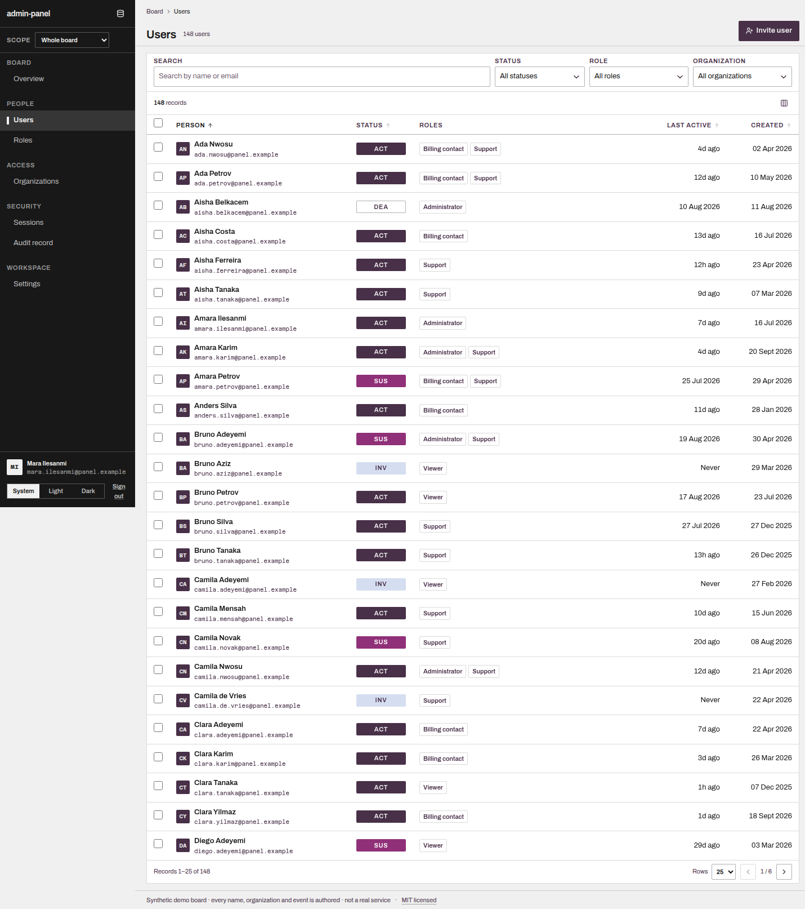
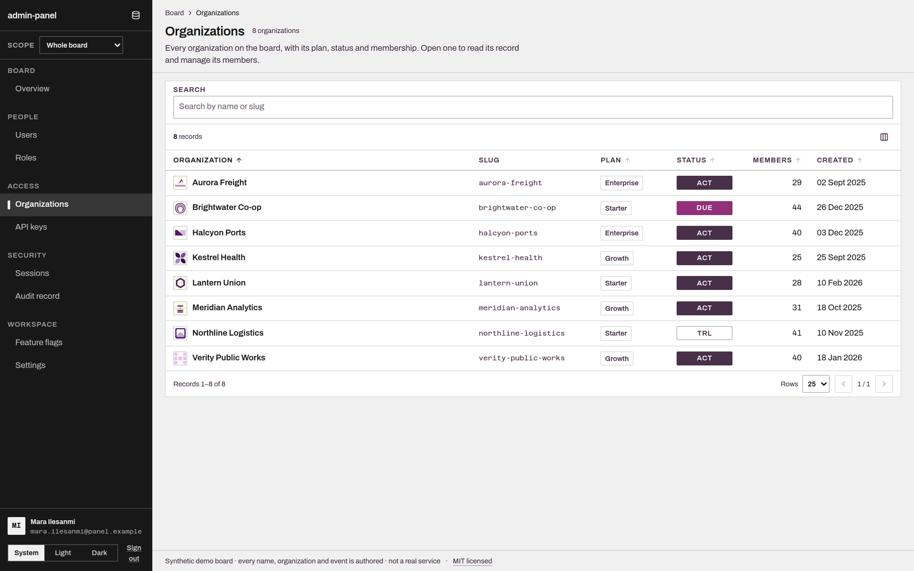
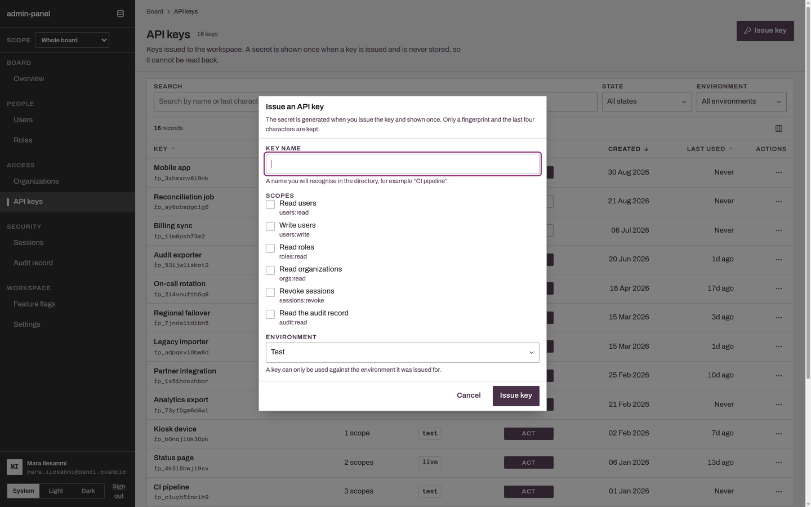
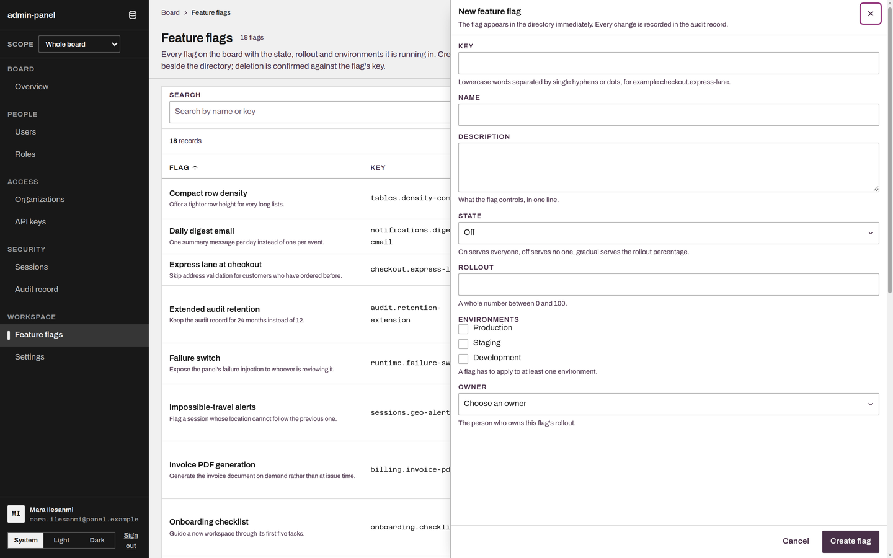
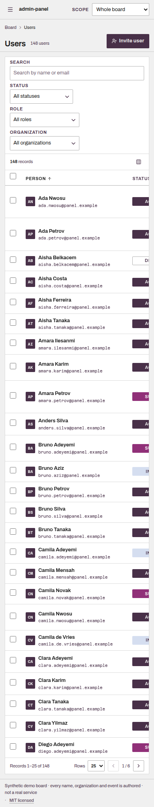

# admin-panel

An operable admin surface for **users, roles, organizations, active sessions and the audit record** —
running end to end on synthetic data, with no server, no account and no setup.

**Live:** https://handover-admin-teal.vercel.app · **License:** MIT

It exists to demonstrate one claim: **the behaviour is specified before it is built, and the design is
measured after it is built.** Two machine-checked gates sit on this repository — a frozen OpenSpec
baseline (**17 capabilities, 85 requirements, 209 scenarios**) and a deterministic design detector.
A UI kit gives you screens; this gives you the contract, the screens that satisfy it, and the evidence
for both.


*The user directory — the dense reading surface: fixed columns, magnets in a dedicated slot, tabular numerals.*


*Organizations, carrying the eight generated marks. These are the only images in the panel.*


*API keys do every operation in one modal dialog. The secret is shown once, here, and never stored.*


*Feature flags edit in a panel that takes half the width and is deliberately non-modal — the directory stays usable beside it.*



**Where the images and icons are, since their absence is deliberate.** There are no decorative icons:
the navigation rail is text and rules by design (an icon-per-nav-item rail is called out and refused in
`DESIGN.md`), and status is a text magnet carrying a three-letter code rather than a coloured glyph.
Icons appear only where they carry meaning — the board-controls trigger, breadcrumb chevrons, sort
carets, pagination, row-action menus, toast marks, delta carets, checkbox ticks. Images appear in one
place: the eight organization marks on the Organizations directory and detail, generated with fal.ai
and attributed with model, seed and prompt in [`docs/design/mock-assets.md`](docs/design/mock-assets.md).
Every other entity is drawn from type — a user is a checkbox, a name and a magnet, not an avatar.

## What you can actually do

Sign in as any of four demo accounts — each demonstrates a different permission state, including a role
that can see the board but change nothing.

- **Overview** — headline counts with a period-over-period comparison, an explicit *"no prior period to
  compare"* instead of a fake zero, recent activity linking into the audit record, and quick actions
  that disappear when your roles do not grant them.
- **Users** — search and filters, sortable columns with announced sort state, row selection with a bulk
  action bar, invite/edit with duplicate-email refusal, suspend/deactivate/reactivate, and a refusal to
  deactivate your own account.
- **Roles** — a grouped permission matrix where edits are staged, with the **blast radius** (how many
  members the pending grants would affect) shown *before* you save, protection for system roles, and a
  rule that refuses to leave the workspace with no administrator.
- **Organizations** — members, per-organization roles, last-owner protection, and a scope control that
  re-scopes the entire board.
- **Sessions** — every active session with device, location, IP and recency, your own session marked,
  and revocation of one or all others (revoking your own ends your session, as it should).
- **Audit record** — append-only, filterable by actor/action/target/date, with a field-level
  before → after detail view, and **no edit or delete affordance anywhere**.
- **API keys** — a directory whose create, edit and revoke all happen **in a modal dialog**. The
  generated secret is shown exactly once and is unrecoverable afterwards (the store keeps a
  fingerprint), revocation requires the key's own name typed, and a revoked key opens read-only with
  no path back.
- **Feature flags** — create and edit in a **panel that slides in from the right at half width**, so
  the directory stays visible *and usable* beside the record you are changing; dismissing it with
  unsaved edits asks first; deletion is confirmed against the flag's own key.
- **Settings** — workspace and personal preferences, slug validation, unsaved-change protection, and a
  destructive zone that requires a typed confirmation.

Every list works **empty** as well as full, distinguishes *no matches* from *failed request*, and has a
retry path. The board controls (top of the rail) can **fail the next request** on purpose, so you can
see the failure state rather than take my word for it.

## Run it

```bash
git clone git@github.com:dinhtrung/admin-panel.git && cd admin-panel
npm install
npm run dev          # http://localhost:5173
```

No environment variable, no secret, no database. `npm run build` writes a static `dist/`.

## The gates

```bash
npm run gate
# typecheck (tsc -b) → lint (oxlint) → openspec validate --all --strict
# → build → impeccable detect (exit 0)
```

Measured on the current commit: `openspec validate --all --strict` → **18 items, 0 failed** (the 17
capability specs plus the one in-flight change; the specs alone carry 85 requirements and 209
scenarios across 17 capabilities). `impeccable detect` → exit 0, with **2 advisories**, both of which
are TanStack Router's built-in fallback error component shipping its own inline constants
(`fontSize: 1rem`, `borderRadius: .25rem`) — code the panel overrides with its own `errorComponent`
and never renders. Everything the detector reads about *this* interface is documented in `DESIGN.md`:
the type ramp (including the display and micro steps), radii (hairline / chip / pill), the palette and
the overlay scrim.

Two things worth knowing before trusting a green design gate elsewhere. The detector runs here over
`dist/`, where it can actually read the shipped CSS — pointed at `src/` alone it sees nothing and
always reports zero. And Tailwind v4's automatic content detection scans *prose*: with the default
scan, the words "rounded" and "shadow" in this repository's own documentation emitted `.rounded` and
Tailwind's entire shadow machinery into the stylesheet, which is why the build declares
`source(none)` and lists its sources explicitly.

## How it is put together

| Question | Single source of truth |
|---|---|
| What must the system do | `openspec/specs/**` — frozen; changes only through a new change |
| What the product is | `PRODUCT.md` |
| What a surface looks like | `.impeccable/surfaces/*.md` (direction contract, written before code) |
| Which tokens shipped | `DESIGN.md` + `.impeccable/design.json` (generated *from* the built code) |

- **Stack:** React 19 + TypeScript, Vite 8, Tailwind CSS v4 (CSS-first tokens), TanStack Router + Query.
  Fonts self-hosted from `@fontsource-variable` (Archivo + Azeret Mono) — no CDN, no hosted stylesheet.
  Icons: **lucide-react** as the primary family, **@tabler/icons-react** where a glyph would otherwise
  have to be hand-authored — one family per control, never two in a row (the rule, and why it exists,
  is in `DESIGN.md`). The eight organization marks are synthetic rasters generated with fal.ai; model,
  seed and prompt for each are in [`docs/design/mock-assets.md`](docs/design/mock-assets.md).
- **Data:** `src/mock/api.ts` is the only data source — deterministic seed, CRUD, simulated latency,
  opt-in failures, browser-local persistence, and **exactly one audit event per state change**. A real
  backend replaces that one module; no screen imports the seed or the store.
- **Design direction — "Handover":** a working board whose type, palette, density and one signature move
  come from the ward handover board tradition, while navigation, layout and controls stay ordinary web
  ones. Status is a **magnet** — a fixed-width chip carrying a three-letter code, a fill weight and a
  hue in a dedicated column — so state survives greyscale, colour blindness and a screenshot. The
  palette is a real COLOURlovers palette, not an invention: provenance, the five swatches and the
  dark-theme role translation are in [`docs/design/palette.md`](docs/design/palette.md).
- **Deployment:** static SPA with deep-link fallback (`vercel.json` rewrites, `public/_redirects`).
  Steps, plus the checks that matter: [`docs/deploy.md`](docs/deploy.md).

## Accessibility, measured rather than asserted

- **Contrast:** every rendered text/ground pair is computed (WCAG 2.1 relative luminance) in **both
  themes** — 249 elements checked in dark, 0 failures; the lowest shipped pair is 6.40:1.
- **Keyboard:** the shell, both dialogs, the menus and the grid are keyboard operable; the collapsed
  navigation opens over the content and returns focus to the control that opened it.
- **Narrow viewport (390px):** no page-level horizontal overflow, the bulk action bar does not obscure
  rows, and the grid scrolls inside its own container.
- **Sort state:** `aria-sort` follows the comparator — clicking a header both ways flips both the
  announcement and the first row (verified by clicking, not by reading the code).

## What is *not* real

- **No backend.** Everything runs in your browser; the store is `localStorage`. Nothing you do leaves
  the machine.
- **No real identity.** Sign-in is a mock: any seeded account, any non-empty password. The four demo
  accounts exist so every permission state is reachable without an administrator ceremony.
- **All data is authored and synthetic** — every person, organization, IP address and audit event.
  There are no customers, benchmarks, prices or testimonials here, and none may be invented.
- Screenshots in this README are captures of the deployed build, not mockups.

## License

MIT — see [`LICENSE`](LICENSE), also served at `/LICENSE.txt` by the deployment.
